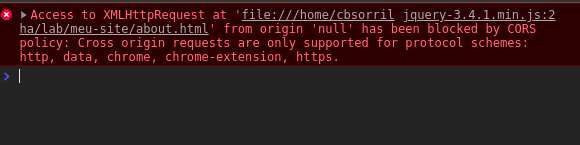

## Introdução

A ideia desse artigo é ensinar como levantar um servidor web basico para fazer experiências com html e css ou scripts JS simples, com foco em requisições http (ajax). Conhecimento prévio em navegação pelo terminal será útil, mas não necessáriamente indispensável. Bom, vamos lá.


## Ai você decide aprender sobre requisições ajax...

Você abre o seu terminal, cria dois arquivos html na pasta onde salva o seu trabalho e seu objetivo é bravamente requisitar o about.html dentro do index.html e assim mostrar o conteudo sobre você logo no inicio da experiência do usuário, sem precisar de navegação. Você cria os arquivos:


```bash
$ touch index.html about.html
```


Ai você escreve o index.html


```html
<!-- index.html -->
<html>
    <body>
        <!-- Você inclui a jQuery SÓ Pra usar o utilizario $.get() -->
        <div id="sobre"></div>
        <script
    src="https://code.jquery.com/jquery-3.4.1.min.js"
    integrity="sha256-CSXorXvZcTkaix6Yvo6HppcZGetbYMGWSFlBw8HfCJo="
    crossorigin="anonymous"></script>
        <script>
            $.get('./about.html').then((conteudo) => {
                $('#sobre').html(conteudo);
            });
        </script>
    </body>
<html>

```
E o about.html

```html
<!-- about.html -->
<html>
    <body>
        <h1>eu sou um desenvolvedor excelente ;)</h1>
    </body>
<html>

```

Daí você vai até sua pastinha, clica duas vezes no arquivo index.html e:



## E agora, José?

O navegador mostrou esse erro por que você tentou realizar uma requisição usando um protocolo inválido. Ele faz isso como medida de segurança, para que conteúdo malicioso não seja servido pra você como se fosse uma página web. Segurança em primeiro lugar.

Pra conseguirmos acessar esse conteúdo precisaremos servir ele como um servidor web. Quando ainda vivíamos em cavernas, no tempo do barro fofo e da pedra lascada usaríamos python ou php para servir esses dois arquivos, o que apesar de funcional ainda está longe de ser eficiente para pequenos estudos como o nosso.

Hoje, no futuro, temos a nossa disposição o poder e a praticidade de um server com um comando de terminal.


## Instalando Node JS

Em primeiro lugar você precisará instalar o Node JS. Para a maioria dos sistemas operacionais eles tem binários prontos e/ou instaladores pra tornar nossa vida mais fácil. Tudo que você precisa fazer é acessar o [site](https://nodejs.org/en/) deles e baixar a versão LTS(mais sobre isso em outro artigo).

Instalado o Node (talvez você precise fechar todas as janelas do seu terminal antes de continuar) é ai que vem o *Jump of the Cat*™.

Desde a versão 5.2.x o NPM (que vem junto com o Node a um tempinho) trás consigo uma belezinha de binário chamado `npx`. Com essa maravilha você consegue executar modulos do node sem instalar, como se fossem apenas comandos. Basta ir, via terminal, até a pasta onde você criou os arquivos e rodar:

```bash
$ npx simplehttpserver .
```

Ai o npx vai baixar o modulo pra você e executar ele na pasta em que você mandou criando um mini servidor local para o seu deleite. Agora é só acessar `http://localhost:8080` e você vai ver o seu conteúdo sendo servido normalmente, incluindo a sua requisição http. :D


